# Enterprise Active Directory Lab (Azure)

## Project Overview

I built a Windows Server Active Directory lab in Microsoft Azure to simulate a workplace environment.

The lab demonstrates:

- Identity and access management
- Domain security policies
- User administration
- Remote access troubleshooting
- DNS verification
- SMB file sharing
- Network traffic analysis using Wireshark

To simulate IT service operations, I also integrated **ServiceNow** workflows for incident management and troubleshooting scenarios.

---

# Environment Architecture

Environment Components

This lab environment simulates a small enterprise Active Directory network running in Microsoft Azure. The goal of the project is to demonstrate common IT Support, System Administration, and Security troubleshooting tasks performed in a real corporate environment.

Infrastructure

Microsoft Azure Virtual Machine (Domain Controller)

Windows Server 2022

Active Directory Domain Services (AD DS)

Windows 10 Client Machine joined to the domain

Domain Name System (DNS) configuration

DHCP network configuration verification

Identity and Access Management

Active Directory user and OU management

PowerShell bulk user automation

Domain authentication testing

Security and Monitoring

Windows Defender Firewall rule configuration

Event Viewer log monitoring for authentication failures

Security event investigation and troubleshooting

Networking and Troubleshooting

DNS resolution testing using nslookup

DHCP configuration verification using ipconfig /all

Network packet analysis using Wireshark

Service Management

ServiceNow incident and request workflow simulation

**Domain Name**

```
remitech.local
```

---

# Active Directory Configuration

## Opening Group Policy Management Console

I began by accessing the **Group Policy Management Console (GPMC)** to configure domain-level policies controlling authentication and security behavior for domain users.

Screenshot:

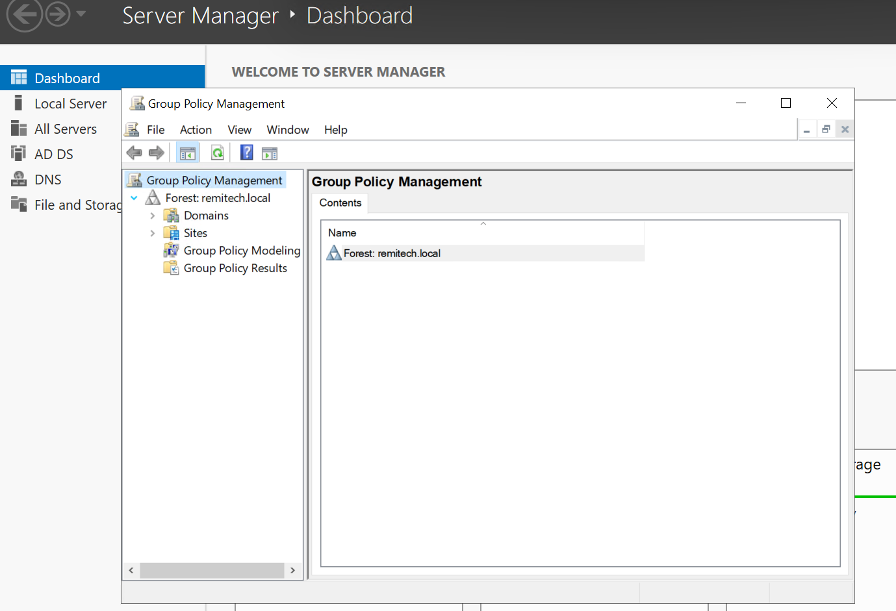

---

## Configuring Password Policy

To enforce secure authentication practices, I configured the **domain password policy**.

This ensures users must follow complexity requirements and regular password changes.

Screenshot:

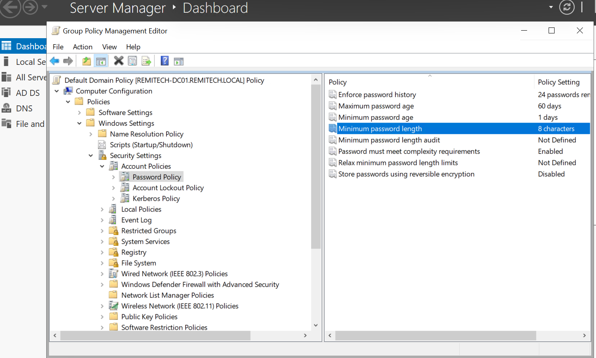

---

## Configuring Account Lockout Policy

To protect against brute-force login attempts, I configured account lockout settings.

Key settings configured:

- Lockout threshold
- Lockout duration
- Reset lockout counter

Screenshot:

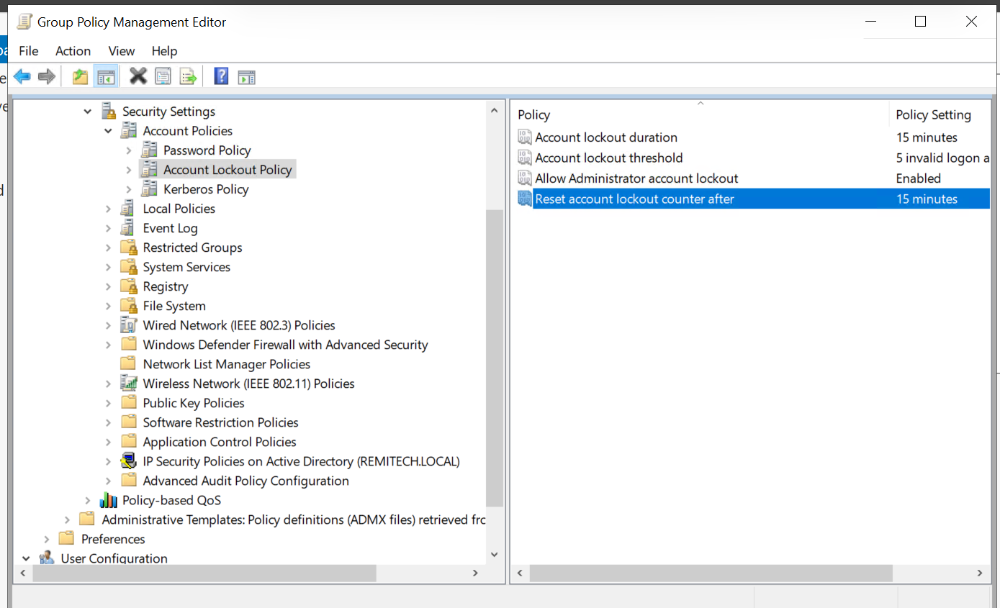

---

## Applying Group Policy Updates

After making policy changes, I forced a Group Policy update to ensure the policies propagated across the domain.

Command used:

```
gpupdate /force
```

Screenshot:

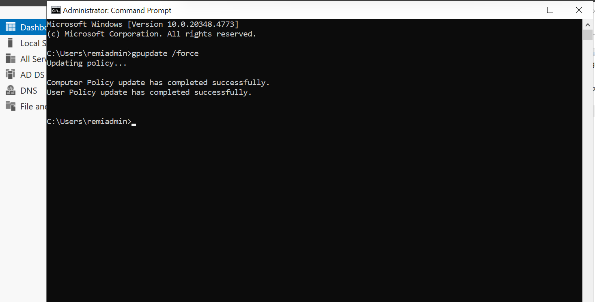

---

# Authentication & Remote Access Testing

## Testing Remote Desktop Connectivity

I tested remote access using **Remote Desktop Protocol (RDP)** to simulate troubleshooting authentication issues commonly handled by IT support teams.

Screenshot:

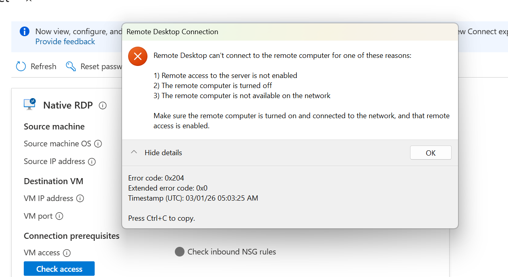

---

## Enforcing Password Change Requirement

I configured user account settings to require password changes at the next login.

This simulates common help desk tasks such as resetting user credentials.

Screenshot:

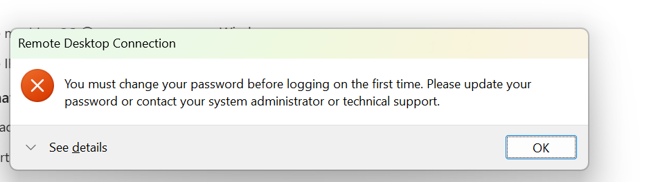

---

## Reviewing Active Directory User Properties

I verified account configurations inside **Active Directory Users and Computers (ADUC)**.

Screenshot:

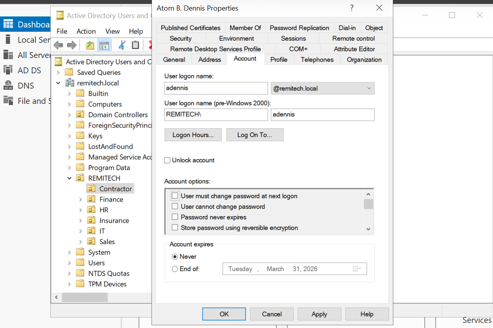

---

## Troubleshooting RDP Authentication

During testing, an authentication error occurred during RDP access.

This allowed me to investigate and troubleshoot the authentication process.

Screenshot:


---

## Simulating Account Lockout Event

I intentionally triggered an account lockout to test the security policy behavior.

This demonstrates how domain security policies behave in real environments.

Screenshot:

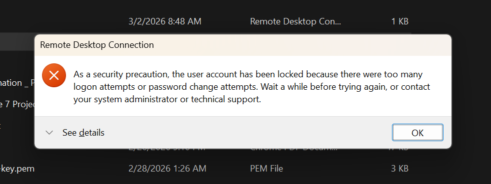

---

## Domain Login Validation

After resolving the issue, I successfully authenticated using the domain account.

Screenshot:

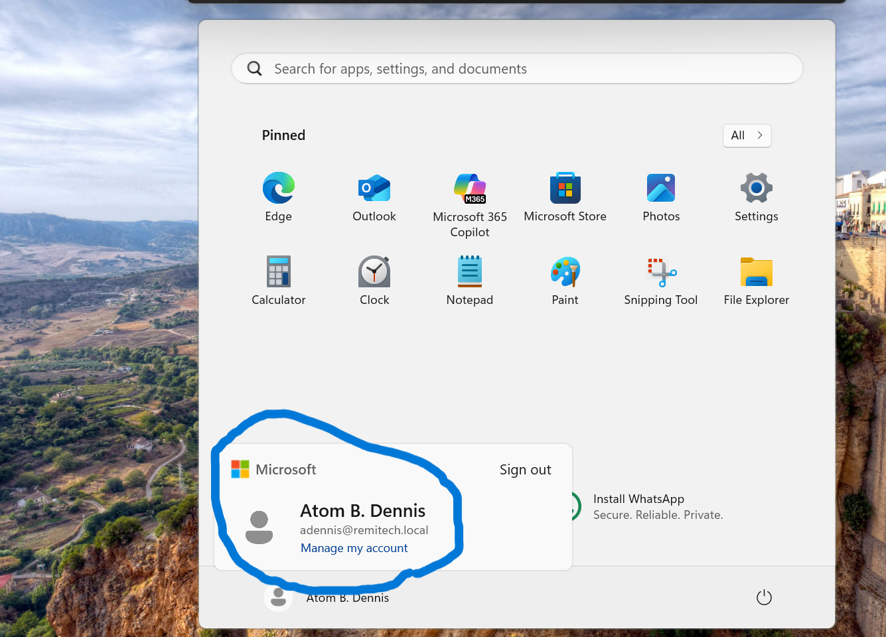

---

# File Services (SMB Share)

To simulate file sharing in an enterprise environment, I configured and tested an **SMB file share**.

This demonstrates how domain users access shared resources.

Screenshot:

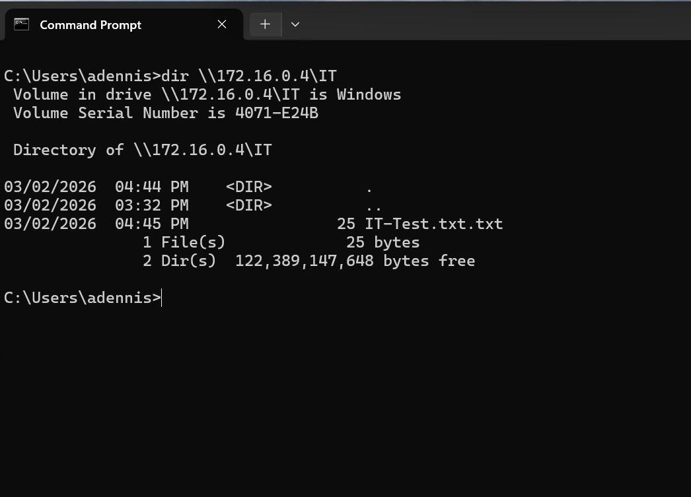

---

# Network Troubleshooting and Traffic Analysis

To better understand network communications inside the environment, I used **Wireshark** to analyze traffic generated by common network activities.

---

## ICMP Traffic Capture

I captured ICMP packets generated during a ping test.

Screenshot:

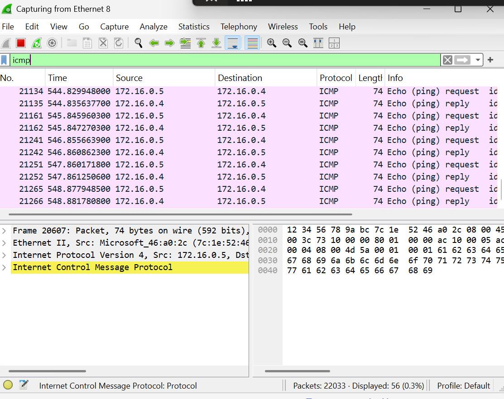

---

## SMB Traffic Analysis

Next, I captured SMB traffic generated from file share access.

Screenshot:

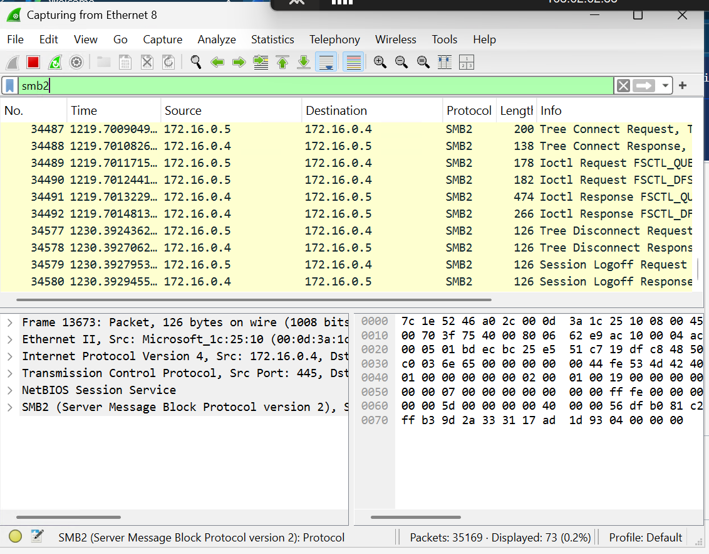

---

## DNS Resolution Test

To validate domain name resolution, I tested DNS queries.

Command used:

```
nslookup remitech.local
```

Screenshot:

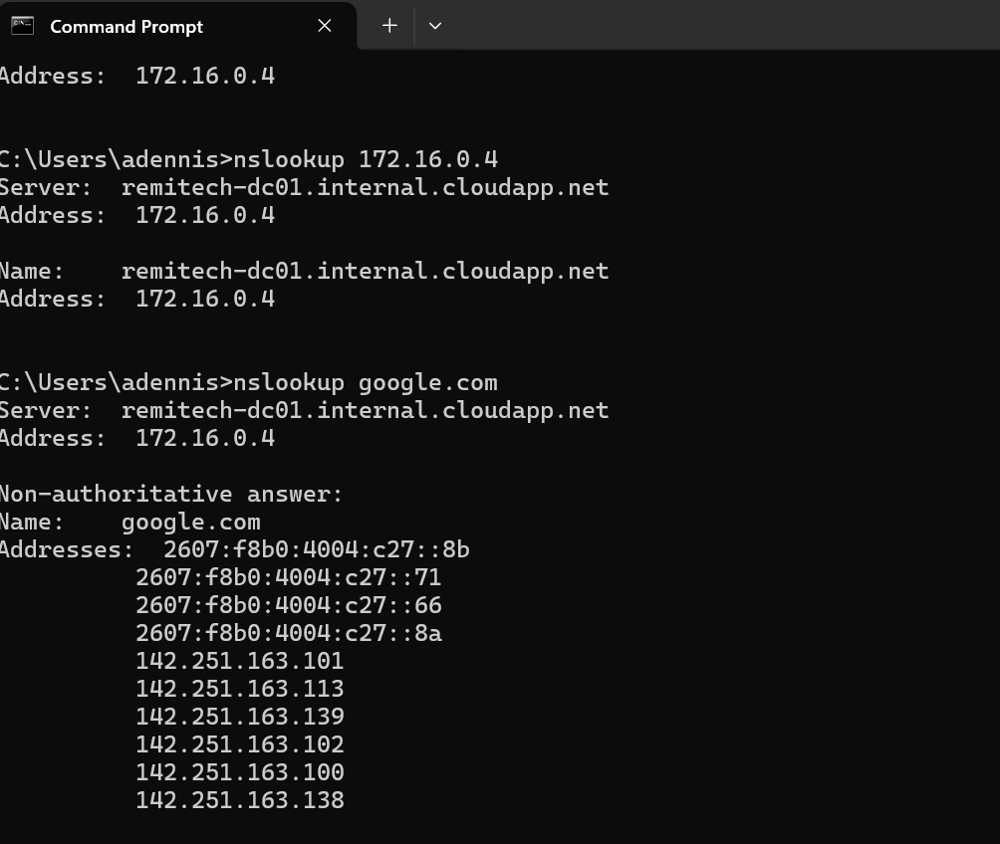

---

## DNS Packet Inspection

I used Wireshark to inspect DNS query packets generated during name resolution.

Screenshot:

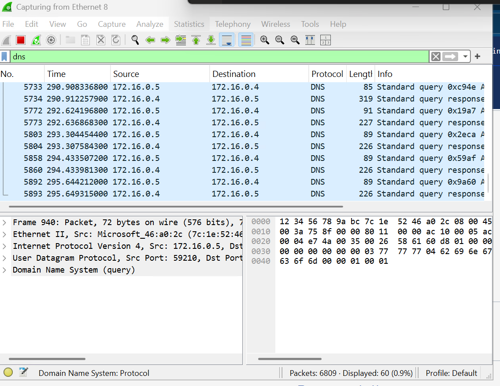

---

# ServiceNow Integration (IT Service Management)

To simulate real IT Service Desk workflows, I created incident tickets in **ServiceNow** related to the issues encountered during the lab.

Example incidents created:

- User account lockout
- Password reset request
- RDP authentication failure
- File share access request
- DNS troubleshooting

Example workflow:

```
Incident Created → Investigation → Resolution → Closure
```

This demonstrates experience using **ITSM platforms and operational ticket workflows**.

(ServiceNow screenshots will be added here.)

---

# Tools Used

- Microsoft Azure
- Windows Server 2022
- Active Directory Domain Services
- Group Policy Management
- PowerShell
- Command Prompt
- Wireshark
- ServiceNow
- SMB File Services
- Remote Desktop Protocol

---

# Key Skills Demonstrated

- Active Directory Administration
- Identity and Access Management
- Group Policy Configuration
- Domain Authentication
- Network Troubleshooting
- DNS Analysis
- SMB File Sharing
- Packet Analysis
- IT Service Management (ServiceNow)
